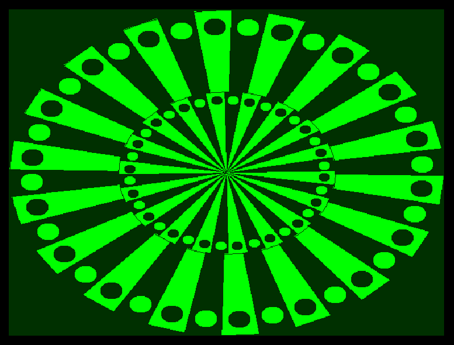

#  Retro-Computer

A fast basic-powered emulator based on an antlr4-grammar

Basic-files will be stored in the directory `HOME/retrocomputer/files`.

The application uses environment variables for the screen-settings:

```
WIDTH=<window-width>
HEIGHT=<window-height>
FULLSCREEN=true|false
```

To start the application, build the project using the maven task `package`
and start it by the `java -jar` command (Java 17+):

```shell
mvn package
java -jar retro-computer-<version>.jar -Xmx1G or -Xms1G
```

## Tech-Stack

| Technology   | Description                                              |
|-------------|----------------------------------------------------------|
| Java 17     | streams, records, lambdas, default-methodes etc.         |
| Maven       | the build-tool                                           |
| Spring Boot | use core features (configuration, Injection, life-cycle) |
| Antlr       | parse and execute basic language using a g4-grammer      |
| Java-AWT    | the simplest way to render graphics on desktop           |

## Basic examples

### SINUS

```
10 MODE 2
20 LINE 0,HEIGHT()/2 TO WIDTH()-1,HEIGHT()/2
30 LINE WIDTH()/2,0 TO WIDTH()/2,HEIGHT()-1
40 Y0=HEIGHT()/2:I0=0
50 FOR I=0 TO WIDTH() STEP 10
60 Y=SIN(PI*2*I/WIDTH())*HEIGHT()/2+HEIGHT()/2
70 LINE I0,Y0 TO I,Y:I0=I:Y0=Y
80 NEXT
90 GOTO 90
```


### ZINSESZINS

```
10 CLS
20 PRINT "**********************"
30 PRINT "* ZINSESZINS-RECHNER *"
40 PRINT "**********************"
50 PRINT
60 PRINT "(1) NEUE EINGABE"
70 PRINT "(2) BISHERIGE EINGABEN"
80 PRINT "(3) ENDE"
90 PRINT
100 A=KEY()
110 IF A="1" THEN 200:REM NEUE EINGABE
120 IF A="2" THEN 300:REM BISHERIGE EINGABEN
130 IF A<>"3" THEN 100
140 CLS:PRINT "BIS DANN..."
150 END
200 REM *** NEUE EINGABE
210 PRINT "GRUNDWERT: ";:INPUT G[N]
220 PRINT "JAHRE: ";:INPUT J[N]
230 PRINT "ZINSSATZ: ";:INPUT Z[N]
240 I=N:PRINT:GOSUB 500:REM AUSGABE
250 N=N+1
260 GOSUB 600:REM WARTEN
270 GOTO 10
300 REM *** BISHERIGE EINGABEN
310 FOR I=0 TO N-1:GOSUB 500:NEXT
320 PRINT
330 GOSUB 600
340 GOTO 10
500 REM *** AUSGABE
510 F=0.01*Z[I]+1:W=FLOAT(G[I])*F^J[I]
520 PRINT I+1;": G=";G[I];", Z=";Z[I];", J=";J[I];" ==> ";W
530 RETURN
600 REM *** WARTEN
610 PRINT "(W)EITER..."
620 IF NOT KEY("W") THEN 620
630 RETURN
```


### TESTBILD

```
10 MODE 2+RND(2)
20 REM LINIEN
30 FOR I=0 TO 639 STEP 16
40 J=I*480/640
50 LINE 0,479-J TO I,0
60 LINE I,0 TO 639,J
70 LINE 0,J TO I,479
80 LINE I,479 TO 639,479-J
85 DELAY 0.01
90 NEXT
100 REM GLOBUS
110 R=120
120 FOR W=0.0 TO PI STEP 0.2
130 R1=COS(W)*R
140 ELLIPSE 319-R1,239-R TO 319+R1,239+R
150 ELLIPSE 319-R,239-R1 TO 319+R,239+R1
160 NEXT
161 DELAY 0.5
162 CTEXT "RETRO COMPUTER 1.0" AT 320, 380
170 DELAY 1:MODE 2+RND(2)
200 REM STARS
210 FOR I=1 TO 50000
220 SET RND(640),RND(480)
230 NEXT
240 GOTO 10
999 GOTO 999
```


### CIRCLE

```
10 MODE 2:ARCADE:A0=0.0
20 MX=WIDTH()/2:MY=HEIGHT()/2
30 F=1:W=WIDTH()/2:H=HEIGHT()/2:GOSUB 200
40 F=-1:W=WIDTH()/4:H=HEIGHT()/4:GOSUB 200
50 A0=A0+0.01
60 FLIP:DELAY 0.005
70 CLS
80 IF NOT KEY(" ") THEN 30
90 END
200 REM *** DRAW
210 FOR I=0 TO 359 STEP 10
220 A1=PI*I/180+A0*F:A2=PI*(I+10)/180+A0*F
230 COLOR C:C=1-C
240 FFACE MX,MY TO MX+SIN(A1)*W, MY+COS(A1)*H TO MX+SIN(A2)*W,MY+COS(A2)*H
250 COLOR C:AA=PI*(I+5)/180+A0*F:FELLIPSE MX+SIN(AA)*W*0.9-W/20,MY+COS(AA)*H*0.9-H/20 TO MX+SIN(AA)*W*0.9+W/20,MY+COS(AA)*H*0.9+H/20
260 NEXT
270 ELLIPSE MX-W+1,MY-H+1 TO MX+W-1,MY+H-1
280 RETURN
```


